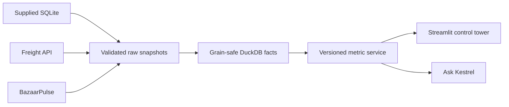

# Kestrel Supply Chain Control Tower

A decision-grade control tower for Kestrel Provisions. It turns the supplied operational
SQLite database, carrier billing API, and BazaarPulse price observations into governed service,
cold-chain, freight, and commercial-leakage insights.

> The supplied database and generated analytical files are intentionally excluded from Git.

## Product promise

- One FY 2026–27 Q1 command centre with the worst performers visible immediately.
- Eaches-default and case-equivalent service metrics from one shared semantic layer.
- Strict OTIF reported transparently alongside fill rate and timestamp-derived on-time service.
- Cold-chain, near-expiry, credit-note, freight, and market-price workspaces.
- A constrained “Ask Kestrel” interface that returns evidence-backed answers, not free-form SQL.
- A permanent trust centre explaining definitions, assumptions, exclusions, and data conflicts.

## Architecture



SQLite is the canonical operational source. CSVs are used for parity validation only; they are
not loaded as a second source. Freight and competitor observations remain at their defensible
native grains instead of being forced into one universal table.

## Local setup

1. Clone the repository and enter it.
2. Copy `.env.example` to `.env`.
3. Set `KESTREL_SOURCE_DB` to the supplied `kestrel_ops.db` path.
4. Run:

```bash
make setup
make doctor
make validate-data
make build
make test
make run
```

The final application opens at `http://localhost:8501`. Integration commands and clean-checkout
details will remain documented here as implementation is completed.

## Metric stance

- Default fill rate: ratio of delivered eaches to ordered eaches.
- Alternate basis: case-equivalents, using `case_pack_at_order`.
- Strict in-full: every eligible line delivered at least its ordered quantity.
- Strict OTIF: timestamp-derived on-time **and** strict in-full at order grain.
- Main credit KPI: approved credit-note value; pending and rejected values stay separate.
- Financial language: measured leakage and exposure, never accounting profit.

The supplied data has no fully delivered order lines, so strict OTIF is 0%. The product treats this
as a prominent data/business-definition conflict and never substitutes an undocumented tolerance.

See [DECISIONS.md](DECISIONS.md) for the deliberately constrained scope and [docs/](docs/) for
requirements, metric, architecture, and data-quality evidence.
