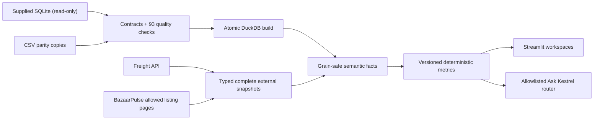

# Kestrel Supply Chain Control Tower

A working, evidence-backed control tower for Kestrel Provisions. It validates the supplied
operational data, builds grain-safe DuckDB facts, ingests carrier invoices and BazaarPulse
observations, and serves a Streamlit decision workspace plus governed natural-language questions.

The supplied database, static site, API server, credentials, caches, and generated analytical
database are deliberately excluded from Git.

## What opens

- **Executive Control Tower** — FY 2026–27 Q1 by default, headline service/risk/leakage signals,
  trends, and worst performers.
- **Service & Fulfilment** — eaches or case-equivalent fill, strict OTIF, lateness, shortages, and
  order evidence.
- **Cold Chain & Inventory** — excursions per 100 chilled deliveries, near-expiry stock, and
  cold-chain-associated returns.
- **Measured Leakage & Freight** — approved credit-note leakage, billed freight per delivered
  case-equivalent, invoice status, and carrier spend.
- **Market Position** — current Kestrel MRP against latest observed, high-confidence competitor
  matches by city.
- **Ask Kestrel** — typed, allowlisted questions using the same metrics as the dashboard; no
  unrestricted text-to-SQL.
- **Data Trust** — definitions, source freshness, reconciliation results, and known conflicts.

Strict OTIF is intentionally **0%**: all 511,516 supplied order lines are short-delivered. The app
does not invent a tolerance. It keeps fill rate and timestamp-derived on-time service visible so
the data remains operationally useful.

## Fastest clean start

Prerequisites: Python 3.11+ and `make`. Clone this repository, then unpack the assignment pack so
the database exists at:

```text
data/source/data/kestrel_ops.db
```

The same unpacked directory should contain `bazaarpulse_site/` and `partner_api/server.py`. Then:

```bash
make start
```

That single command creates `.venv`, installs dependencies, checks and validates the source,
atomically builds `.kestrel/kestrel.duckdb`, collects the bundled BazaarPulse pages, runs
conservative product matching, and opens the app at [http://localhost:8501](http://localhost:8501).

If the pack lives elsewhere, create `.env` first:

```bash
cp .env.example .env
```

Set `KESTREL_SOURCE_DB` and, when needed, `KESTREL_BAZAARPULSE_SITE_ROOT` to absolute paths. Run
`make doctor` for actionable path/configuration checks.

## Enable the freight workspace

The freight API is the supplied local mock, not an internet service. In a second terminal:

```bash
.venv/bin/python data/source/partner_api/server.py
```

Put the key documented in the assignment pack into local `.env` as
`KESTREL_FREIGHT_API_KEY`—never into Git—then run:

```bash
make sync-freight
```

The default sync is FY 2026–27 Q1 (`2026-04-01` through `2026-06-30`) so the front page is useful
quickly. A custom or full range is supported:

```bash
.venv/bin/kestrel sync-freight --from 2025-01-01 --to 2026-06-30
```

The client follows cursor pagination to completion, retries 429/503/timeouts with bounded backoff,
honours `Retry-After`, converts paise exactly once, checkpoints interrupted walks, and only promotes
a complete cache. After an analytical rebuild, an existing cache can be republished without the
API:

```bash
.venv/bin/kestrel sync-freight --offline-cache
```

## Common commands

```bash
make prepare         # doctor + source validation + build + BazaarPulse snapshot
make validate-data   # 93 schema, grain, FK, parity, and conflict checks
make build           # atomic SQLite -> DuckDB rebuild
make scrape-prices   # robots-safe local scrape and confidence-scored matching
make sync-freight    # resilient Q1 API synchronization
make run             # start Streamlit without rebuilding
make test            # deterministic unit/integration-contract tests
make lint            # Ruff + mypy
make clean           # explains safe cleanup; use the printed --yes form explicitly
```

`kestrel_ops.db`, CSV copies, `.env`, DuckDB files, caches, and cursor checkpoints are ignored. The
application opens the operational SQLite source read-only and never edits supplied data.

## Metric stance

| Metric | Governed calculation | Grain / date basis |
|---|---|---|
| Fill rate | `sum(delivered) / sum(ordered)`; eaches default, case-equivalents selectable | Line ratios aggregated to requested-delivery cohort |
| Strict OTIF | Parsed actual arrival on/before planned arrival **and** every line delivered in full | Order / requested delivery date |
| Chilled excursions | `100 × excursion deliveries / chilled deliveries` | Distinct delivery / actual delivery date |
| Near expiry | Available cases with 0–30 days remaining | Latest weekly snapshot on/before period end |
| Credit leakage | Approved credit-note value / estimated delivered dispatch value | Independently aggregated return and line facts |
| Freight per case | `(invoice amount + detention) / delivered case-equivalents` | Independently aggregated service period × warehouse |
| Market gap | Current Kestrel MRP − lowest available matched observation | SKU × city / listing `last_seen` |

“Measured leakage” is deliberate language. The pack does not contain complete COGS, collections,
labour, rent, tax settlement, or overhead, so this repository never claims accounting profit.

## Architecture and trust model



There is no mega-join. Orders, deliveries, returns, inventory, freight invoices, and competitor
listings stay at their native grains. In particular, freight has no order/delivery key: numerator
and denominator are aggregated independently at period × warehouse (or route), never joined row by
row. Customer region and origin/DC region remain separate dimensions.

See:

- [DECISIONS.md](DECISIONS.md) — one-page scope and trade-offs.
- [docs/ARCHITECTURE.md](docs/ARCHITECTURE.md) — value chain, grains, lineage, and scaling path.
- [docs/METRICS.md](docs/METRICS.md) — formulas, eligibility, dates, and evidence rules.
- [docs/DATA_QUALITY.md](docs/DATA_QUALITY.md) — verified issue register.
- [docs/REQUIREMENTS.md](docs/REQUIREMENTS.md) — brief-to-feature traceability.

## Troubleshooting

- **Source database not found:** unpack the pack at `data/source/` or set
  `KESTREL_SOURCE_DB` in `.env`; run `make doctor`.
- **Freight unavailable:** start the supplied server, configure its key locally, and run
  `make sync-freight`; the rest of the app remains available.
- **Competitor snapshot unavailable:** ensure the supplied `bazaarpulse_site` path is present and
  run `make scrape-prices`. The scraper never reads `/internal` or `/admin`.
- **A sync was interrupted:** rerun the same freight command to resume its compatible checkpoint.
- **Analytical database was rebuilt:** rerun the two integration commands; freight may use
  `--offline-cache`.
