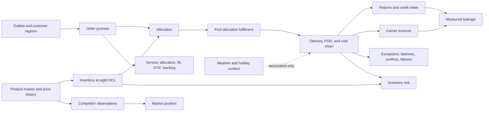
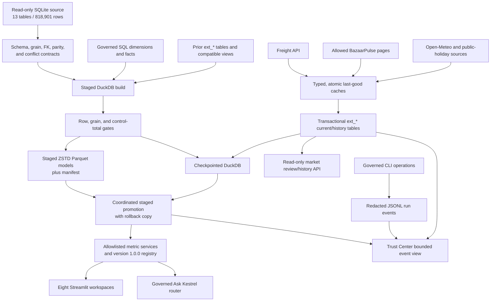

# Architecture and Value Chain

## Purpose and design stance

Kestrel is a local-first analytical control tower over the supplied synthetic operational pack.
It keeps source data immutable, resolves analytical ambiguity in a governed semantic layer, and
publishes the same definitions to eight Streamlit workspaces and Ask Kestrel. DuckDB is the
interactive store; compressed Parquet plus a fingerprinted manifest is the portable analytical
snapshot.

The value-chain graph below is a business map, not a graph-database requirement. The source keys,
native fact grains, aggregations, and questions are relational. Introducing a graph database would
create a second semantic system without making the required calculations more defensible.

## Business value chain

## End-to-end system flow

The dashboard never contacts an external service on startup. External refreshes are explicit,
independently failure-isolated operations. A missing optional cache degrades only the evidence that
depends on it.

## Eight decision workspaces

| Workspace | Decision supported | Primary boundary |
|---|---|---|
| Executive Command Center | Where service, risk, measured leakage, settled freight, and market coverage require attention | Both fill bases, governed ratios/volumes, exception inbox, and qualified worst/best/improved groups |
| Service & Fulfilment | Which promise, allocation, fulfilment, source, and recorded-promotion segments underperform | Requested-delivery line cohort; ordered → allocated → delivered → linked return; eaches default, case-equivalents selectable |
| Delivery & Exception Drivers | Which operational exceptions are associated with late delivery | Actual-delivery cohort; minimum-volume guard; no causal or blame claim |
| Cold Chain & Inventory Risk | Where chilled delivery severity and expiring/damaged/blocked batches concentrate | Distinct-delivery excursion grain and max-temperature evidence; latest eligible weekly batch snapshot |
| Commercial Leakage & Logistics Cost | Which measured credits, short-delivery exposures, dispositions, and carrier invoices are material | PAID settled freight is primary; separate return, delivery, and invoice facts; not accounting profit or recovery |
| Market & External Context | Where current/effective-dated MRP differs from current or source-dated governed shelf observations and optional context cohorts differ | Raw and 100G/100ML price evidence, high-confidence final matches, and publication-gated descriptive associations |
| Ask Kestrel | Reusable management questions with evidence | Typed intent router calls the same metric services; no unrestricted SQL |
| Trust Center | Whether definitions, sources, syncs, and operations are trustworthy | Versioned registry, conflict evidence, freshness, sync history, bounded run events |

## Layer responsibilities

1. **Configuration** resolves project-relative or explicit environment paths. Secrets remain in a
   local `.env`; generated state remains under `.kestrel/`.
2. **Source contracts** open SQLite read-only and validate the 13 declared schemas, primary grains,
   relationships, quantities, CSV parity, and known conflicts before transformation.
3. **Warehouse construction** streams raw tables, preserves raw and normalized values, executes
   governed SQL, checks model grains and totals, and publishes DuckDB and Parquet together.
4. **Integration adapters** validate, retry, checkpoint, cache, and publish external observations
   at their native grain. No partial refresh replaces a last-good snapshot.
5. **Metric services** use parameterized queries and allowlisted dimensions. The registry in
   `config/metrics.yml` supplies definition metadata and semantic versions.
6. **Experience layers** render results and evidence. Streamlit pages and Ask Kestrel do not own or
   duplicate formulas. The market API is read-only.
7. **Observability** records local CLI start, success, and failure events with duration and a run ID.
   Sensitive-key fields are recursively redacted before append to JSONL.

## Staged and coordinated analytical publication

`kestrel build` uses a coordinated staged publication:

1. Fingerprint and validate the source; stop on any blocking gate.
2. Build all raw, dimension, fact, quality, source-snapshot, and pipeline-run tables in a unique
   temporary DuckDB file.
3. Copy the previous warehouse's `external_sync_runs`, physical `ext_*` tables, and compatible
   external views into the staged warehouse. A physical-table copy failure stops publication.
4. Reconcile model row counts and native grains, then checkpoint the staged database.
5. Export the governed table set as ZSTD Parquet into a unique staging directory. Write
   `manifest.json` with schema version, source SHA-256, completion timestamp, and per-table counts.
6. Promote the Parquet directory while retaining the previous directory as a rollback copy, then
   replace the DuckDB file. If database promotion fails, restore the former Parquet directory.
7. Delete staging and backup artifacts only after success.

Neither DuckDB nor an individual Parquet file is exposed half-written. Promotion is coordinated and
rollback-protected, but a local filesystem cannot provide one transaction spanning a database file
and a directory. Consumers that read both during a build should use the manifest/source fingerprint
as the consistency boundary or wait for the build command to finish. Rebuilds retain previously
published freight, context, and competitor history. External syncs use their own database
transactions and last-good caches.

## Semantic grains and join policy

| Model | One row means | Key | Defensible alignment |
|---|---|---|---|
| `fct_order_line` | Booked product line with source-specific creation parse, recorded promotion/source, order-time pack, quantities, allocation, delivery, price, and proportional short exposure | `order_line_id` | Order, outlet, product, DC, route, salesperson, order source, promotion |
| `fct_order_service` | Order-level service rollup with its supplied delivery, creation parse status, and recorded source/promotion | `order_id` | Requested-delivery cohorts and service dimensions |
| `fct_delivery` | Delivery event with parsed timestamps, POD, cold-chain, and conflict flags | `delivery_id` | Actual-delivery date, DC, route, outlet, vendor |
| `fct_return_credit_note` | Return or credit-note line | `return_id` | Exact original `order_line_id` and associated dimensions |
| `fct_inventory_snapshot` | Weekly DC × SKU × batch observation | `snapshot_id` | Snapshot-relative inventory only |
| `ext_freight_invoice_current` | Carrier invoice | `invoice_id` | Service period plus DC **or** route; no order/delivery key |
| `ext_bazaarpulse_listing_current` | Latest listing card | `listing_id` | City/retailer; SKU only through a final governed match |
| BazaarPulse history tables | One immutable listing/match observation in a sync | `sync_id + listing_id` | Historical provenance and review evidence |
| `ext_bazaarpulse_source_price_observation` | One source-dated detail-page price observation | Stable source observation ID | Listing/retailer/date; SKU only through a final governed match; historical MRP resolved effective on observation date |
| `ext_weather_daily_current` | Warehouse-city-centroid weather for one date | Warehouse code × date | Delivery date × warehouse after coverage gates |
| `ext_india_holiday_current` | National public holiday date | Holiday date | Requested-delivery date after cohort gates |

Facts are not combined into a fan-out mega-join. A fact-to-fact calculation aggregates each side
first unless an exact source key exists. Freight per case therefore aligns independently aggregated
invoice and delivered-case totals. Inventory is never reconstructed between weekly observations.

## Identity, time, and geography

- Operational surrogate IDs remain join keys; names and codes are display attributes.
- Customer/order region and origin/DC region are different concepts and are labelled separately.
  Ask Kestrel requests clarification when an unqualified region could mean either.
- Known Bangalore/Bengaluru and New Delhi/Delhi city variants are canonicalized while raw values
  remain available.
- Requested delivery date is the service-promise cohort. Actual delivery date is the operational
  delivery/cold-chain cohort. Return date, snapshot date, freight service date, and listing
  observation date remain distinct.
- Order creation text is parsed by `source_system`: ERP `DD/MM/YYYY HH:MM`, SFA
  `YYYY-MM-DD HH:MM:SS`, and partner ISO `...Z` converted from UTC to IST. Raw text,
  `created_at_ist`, and parse status coexist. No KPI uses order creation time.
- Parsed `actual_arrival <= planned_arrival` is the governed on-time test. Conflicting stored delay
  remains visible as evidence; it is not silently overwritten.

## External reliability and governance

- Freight follows cursors through termination, honors `Retry-After`, uses bounded retry/backoff for
  `429`, `503`, and transport failures, checkpoints an interrupted walk, validates types and range,
  and promotes only a complete last-good cache.
- BazaarPulse reads only allowed listing and product-detail paths, observes the HTTP crawl interval,
  validates the current listing snapshot, applies automatic confidence/ambiguity gates, then
  accountable YAML match/reject decisions. Reviewed matches cannot bypass brand, pack, or 0.80
  candidate safety. The verified current set is 1,137 listings: 1,088 matched and 49 in review.
- BazaarPulse current and append-only history tables are updated transactionally. Replay of an
  identical observation identity is idempotent; a changed payload for that identity is rejected.
- Detail-page source history is separately append-only: 6,804 observations from 1,134 pages over
  2026-05-06–2026-06-30. Missing pages `387`, `458`, and `777` are structured warnings. Historical
  views resolve the Kestrel MRP effective on each observation date and expose 100G/100ML normalized
  prices only for comparable mass/volume packs.
- Weather and holidays use separate typed caches and isolated publication. Descriptive comparisons
  are withheld when coverage, freshness, join, or cohort gates fail.
- All optional evidence exposes observed coverage, completion, and freshness. It never changes the
  strict operational metric definition.

## Security, privacy, and operational limits

- The supplied database and CSVs are synthetic but still excluded from Git; all sources are opened
  read-only.
- API keys and local configuration are excluded. Docker receives the freight key through its
  environment rather than an image layer.
- JSONL operation logs redact keys containing `api_key`, `password`, `secret`, `token`, or
  `credential`. The Trust Center displays only a bounded recent event set.
- The container runs as a non-root user, mounts `data/source` read-only, installs the pinned runtime
  lock, and exposes a health check.
- Local files are not a multi-writer production design. No accounting profit, causal inference,
  route-weather reconstruction, or historical order-status reconstruction is claimed.

## Deployment and scale path

The supported evaluation modes are a Python 3.11 virtual environment and Docker Compose. CI uses
the version-pinned development lock to run Ruff, mypy, and pytest, and separately builds the runtime
image. The floating Python base tag and unpinned pip/setuptools remain environment-level limits.

At roughly 100 times the supplied volume, the first constraints would be full single-node rebuilds,
local file locking, synchronous UI queries, and scheduled external collection. Preserve the same
grains, definitions, gates, provenance, and read-only query boundary while moving immutable raw
snapshots to object storage, transformations to incremental warehouse jobs, common results to
materialized aggregates, integration refreshes to an orchestrator, and the UI behind a cached
service layer.
