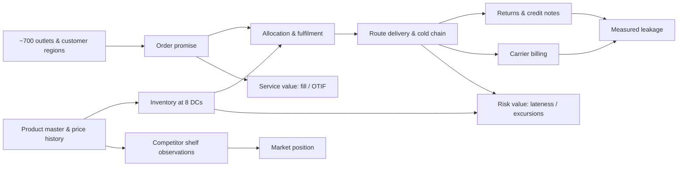

# Architecture and Value Chain

## Business value chain

The graph is a business map, not a graph-database requirement. The supplied relationships and
analytical questions are naturally expressed as governed relational facts. A graph database would
add a second semantic system without improving the required calculations.

## Runtime flow

1. `contracts.py` opens SQLite read-only and validates 13 declared schemas, primary grains,
   foreign keys, quantities, known conflicts, and CSV parity.
2. `warehouse.py` streams every source table into a temporary DuckDB file, builds dimensions and
   facts, checks row counts/distinct grains/control totals, checkpoints, then atomically promotes
   the file. A failed build leaves the previous warehouse untouched.
3. External clients independently build atomic last-good JSON caches. Only complete, validated
   snapshots are published into the analytical database.
4. `AnalyticsService` and `ExternalAnalyticsService` expose parameterized, dimension-allowlisted
   metric methods. UI pages and Ask Kestrel call those services rather than duplicating formulas.
5. The Streamlit layer renders evidence and definitions; it does not own business calculations.

## Semantic grains

| Model | One row means | Key | Permitted alignment |
|---|---|---|---|
| `fct_order_line` | Booked product line with normalized quantities and price at order | `order_line_id` | Product/order/outlet/DC/route dimensions |
| `fct_order_service` | Order-level line rollup plus its single supplied delivery | `order_id` | Requested-delivery cohorts and service dimensions |
| `fct_delivery` | Delivery event with parsed timestamps and cold-chain flags | `delivery_id` | Actual delivery date, warehouse, route, outlet |
| `fct_return_credit_note` | Return/credit-note line | `return_id` | Exact original `order_line_id` plus associated dimensions |
| `fct_inventory_snapshot` | Weekly warehouse × product × batch observation | `snapshot_id` | Snapshot-relative inventory only |
| `ext_freight_invoice_current` | Carrier invoice | `invoice_id` | Service period plus warehouse **or** route; no order link |
| `ext_bazaarpulse_listing_current` | Latest collected listing card | `listing_id` | City/retailer; SKU only through audited match outcome |

No fact is joined directly to another fact before aggregation unless the source provides an exact
key. This prevents return, delivery, invoice, and inventory fan-out.

## Identity and geography

- Surrogate IDs remain the operational join keys; names are display attributes.
- `orders.region_id` is the customer/order region. Warehouse and route region are logistics-origin
  dimensions and are always labeled separately.
- Outlet city is preserved raw and canonicalized for known Bangalore/Bengaluru and New Delhi/Delhi
  variants.
- Competitor identity resolution scores name, brand, normalized pack, and category. A result must
  clear both confidence and ambiguity-margin gates; matching is allowed to fail.

## Reliability boundaries

- Supplied source data is immutable; raw values and normalized values coexist.
- API retries are bounded. Cursor, partial rows, complete cache, and analytical publication are
  distinct states.
- BazaarPulse collection checks disallowed paths before I/O and follows only known listing-page
  pagination. Local filesystem mode avoids pretending a network crawl occurred; HTTP mode enforces
  the crawl interval.
- Secrets live only in `.env`. Source databases and generated artifacts are ignored.
- Missing optional snapshots degrade individual workspaces, not the operational control tower.

## Scaling to 100×

The first limits are the full single-node rebuild and synchronous UI queries, not the semantic
contracts. Move immutable raw snapshots to partitioned object storage, transform incrementally in
a managed warehouse, materialize common aggregates, and run integrations through scheduled jobs.
Keep the same grains, metric definitions, typed query boundary, reconciliation tests, and freshness
metadata. Streamlit can then call a service/cache layer rather than a local DuckDB file.
